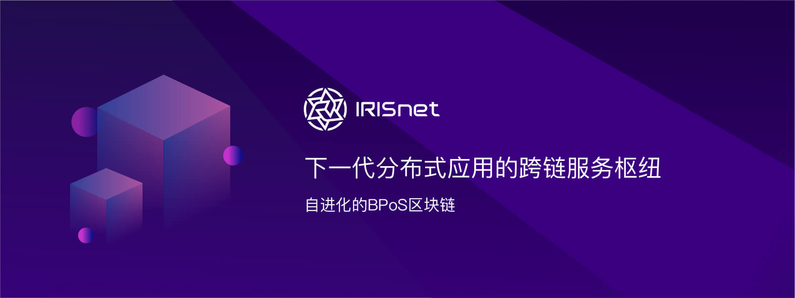

# IRITA 文档

## IRITA简介

跨域行业互信联盟产品（Inter-Realm Industry Trust Alliance，简称IRITA)，是Cosmos生态中第一个企业级许可链产品，是基于现代区块链技术框架Tendermint和IRIS SDK，并结合边界智能团队多年行业经验打造的联盟链产品，具有保护隐私的数据加密共享、高可扩展的共识协议、最前沿的跨链技术、实用性极强的跨系统交互能力、数字资产建模与交易支持等6大核心技术优势，可广泛应用于金融业等多种行业，提供基于区块链信任机器的价值赋能。

IRITA 可以灵活使用在多种行业，尤其在金融创新行业，围绕资产数字化后的确权和流通，具有6大核心技术优势：

- 共识底层：Tendermint是首个可以在互联网级别可应用的拜占庭共识协议，是Libra也沿用的共识技术
- 跨链IBC：国际合作团队贡献了业内公认的、最前沿跨链技术标准设计与实施
- 数据授权共享：数据在链上加密存储，保护各方数据所有权和隐私；只有用户授权，数据才会共享给第三方
- iService：链上链下各类型系统的交互，基于IRIS SDK将各类技术的有机结合、自然演进过渡
- 数字资产建模与交易：以供应链等实际场景切入，并可快速推广、扩展至知识产权、医药、存证等各行业
- 大数据支持：自带存储层支持云存储和分布式存储；数据仓库和链式数据结合支持链上数据高效全生命周期查询

## IRITA解决方案整体架构

使用IRITA产品的区块链行业解决方案架构示例如下：

其中，IRITA产品可提供包括区块链核心层、接口层的强大底层支持功能。除了区块链之外，IRITA还集成了分布式存储、身份证书管理、隐私计算等链外能力。以IRITA底层平台为基础，开发者可为各行业灵活定制边缘应用服务（EdgeServer）以及业务应用，并可通过IBC和iService连接各类外部的异构系统。

### IRITA服务

IRITA服务（又名“iService”）的目标是弥合区块链世界与传统商业应用世界之间的鸿沟，居中协调链下服务的整个生命周期 - 从定义、绑定（提供者注册）、调用，直到它们的治理（描画和仲裁）。

### 生命周期

- 定义：根据接口定义语言（IDL）文件定义链下iService可以做什么。
- 绑定：声明实现给​​定iService定义的提供者端点的位置（地址），定价和服务质量。
- 调用：处理针对给定iService提供者端点的消费者请求以及相应的提供者响应。

### 提供者

提供者 （Provider）是提供一个或多个iService定义实现的网络用户，通常充当位于其他公有链、联盟链以及企业现有系统中的链下服务和资源的 适配器。它们监听和处理传入的请求，并将响应发送回网络。提供者可以通过向其他提供者发送请求来同时充当消费者。按照计划，提供者需要为他们可能提供的服务收取费用。

### 消费者

消费者（Consumer）是那些使用iService的用户，他们向指定的提供者端点发送请求并接收相关提供者的响应。

### 分析员

分析员（Profiler）是一种特殊用户，代表了发起建立IRIS网络的IRIS基金会有限公司（IRIS Foundation Limited），这是一家注册在香港的股份有限公司。分析员是在分析模式中调用iService的唯一授权用户，旨在帮助创建和维护服务提供者的分析画像，通过这些客观的分析画像服务消费者可以选择合适的服务提供者。
### 仲裁员

仲裁员 （Arbitrator）是自我声明的一类用户，他们协助消费者对投诉（服务提供者的表现）进行仲裁。
